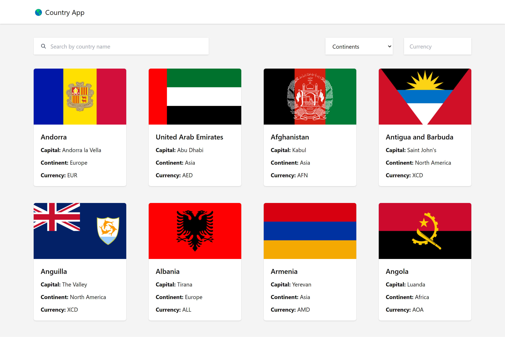
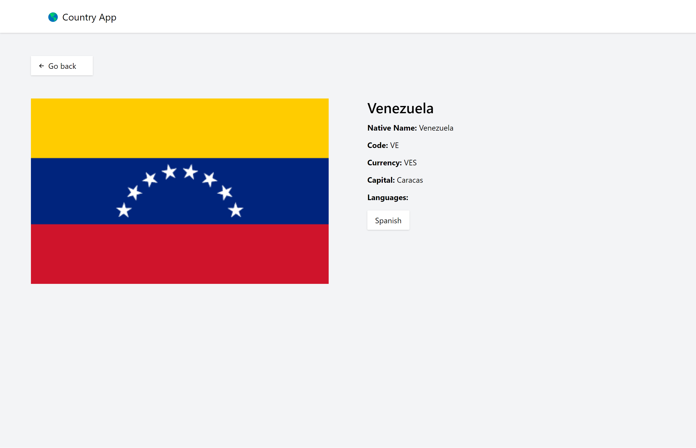
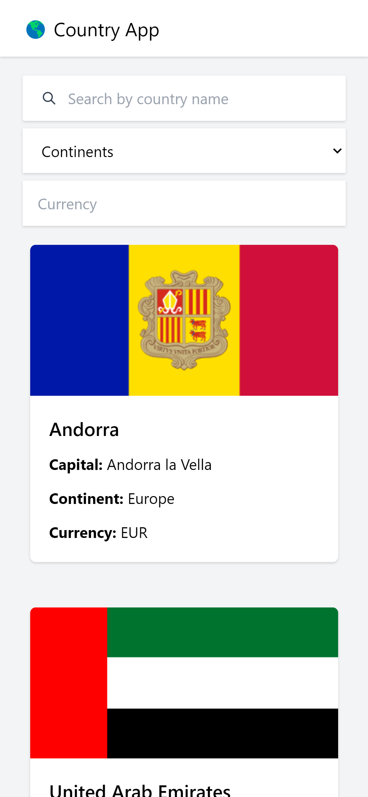
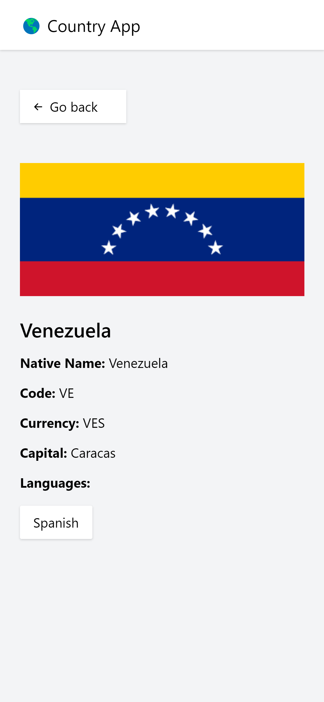

# 🌎 Country app (React + Typescipt + Graphql + ApolloClient)

 

## 🚀 Demo

See demo [here](https://country-app-tan.vercel.app/)

## 👩‍💻 Project explanation

Web application that shows country information. Information such as flag, capital, languages, currency among others. All this is consumed from the API in `graphql`: <https://countries.trevorblades.com/>.

## 🛠️ Environment Setup

### Needed tools

1. Install [node.js](https://nodejs.org/)
2. Clone this project: `git clone https://github.com/sherzo/country-app`
3. Move to the project folder: `cd country-app`

### 🔥 Application execution

1. Install all the dependencies `yarn install` or `npm install`
2. Run dev: `yarn start` or `npm run start`
3. Open in your browser: `http://localhost:3000`

## 🤳 Responsive

|  Countries | Country |
|    --      |    --   |
|  |  |
| | |
